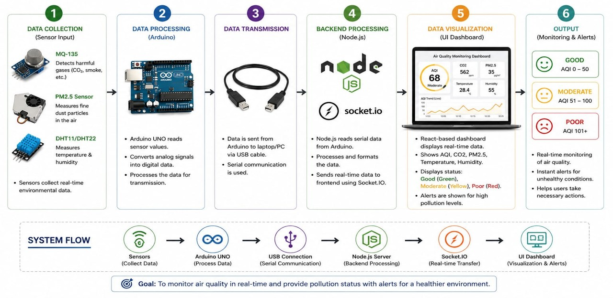
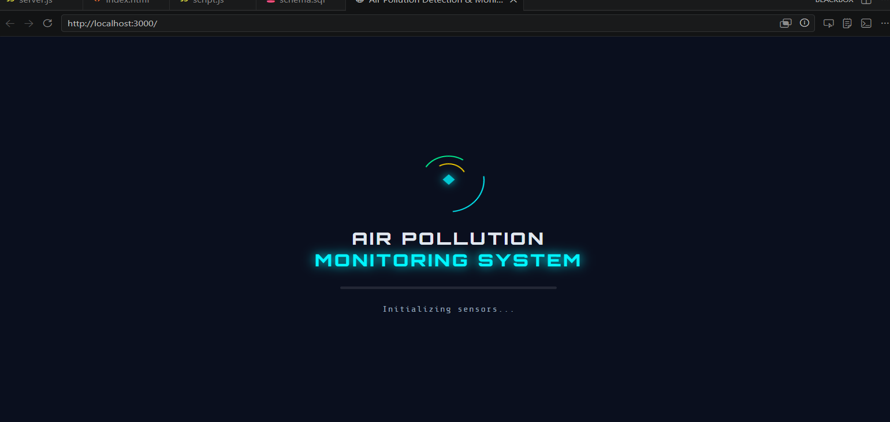
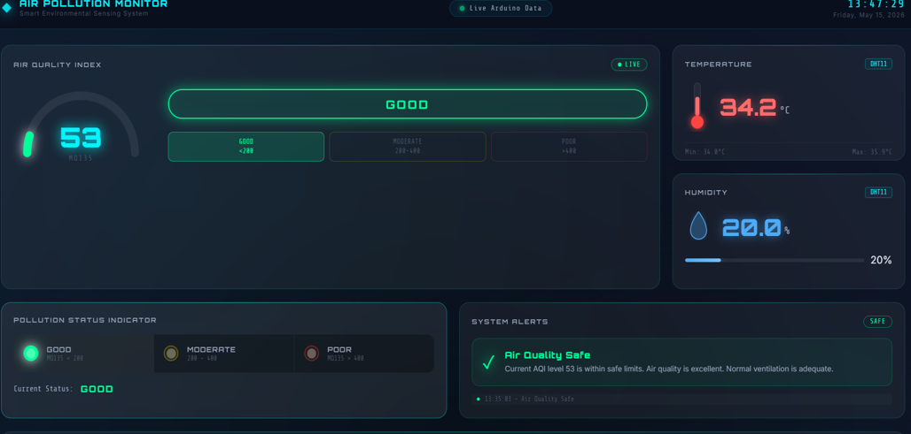
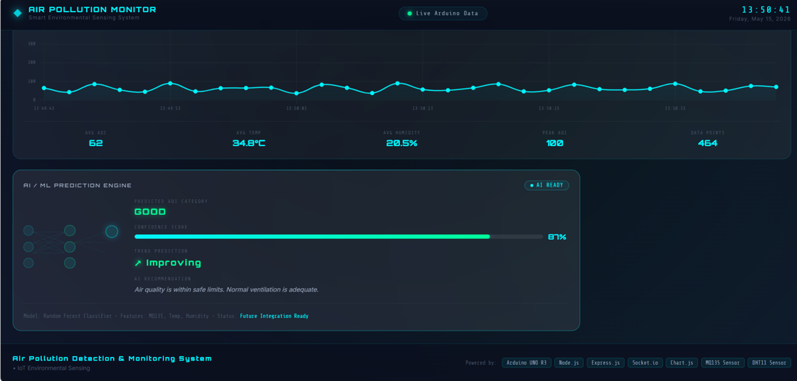

# Air Pollution Detection and Monitoring System

## 📌 Project Overview

The Air Pollution Detection and Monitoring System is an IoT-based system designed to monitor air quality and environmental conditions in real time.

The system uses the MQ135 gas sensor to detect air pollution levels and the DHT11 sensor to measure temperature and humidity. An Arduino UNO collects sensor data and sends it to the backend system. The collected data is displayed on a real-time web dashboard.

The system also includes a machine learning component for air quality analysis and prediction.

---

## 🎯 Objectives

- To detect and monitor air pollution levels in real time.
- To measure temperature and humidity using the DHT11 sensor.
- To monitor air quality using the MQ135 gas sensor.
- To display live sensor readings on a web dashboard.
- To store sensor data for further analysis.
- To use machine learning for air quality prediction.
- To provide a simple and user-friendly monitoring system.

---

## ✨ Features

- Real-time air quality monitoring
- MQ135 gas sensor for air pollution detection
- DHT11 sensor for temperature and humidity measurement
- Arduino UNO based data collection
- Real-time web dashboard
- Air quality status monitoring
- Database storage of sensor readings
- Machine learning based prediction
- Interactive and user-friendly interface

---

## 🔄 Methodology

<p align="center">
  
</p>

## Arduino UNO Code

<p align="center">
  
</p>

## Loading_page

<p align="center">
  
</p>

## Dashboard_with_Status
<p align="center">
  
</p>

## Graph_&_MLPrediction
<p align="center">
  
</p>
## 🛠️ Hardware Components

- Arduino UNO
- MQ135 Gas Sensor
- DHT11 Temperature and Humidity Sensor
- Breadboard
- Jumper Wires
- USB Cable

---

## 💻 Software and Technologies

- Arduino IDE
- Node.js
- Express.js
- JavaScript
- HTML
- CSS
- Python
- Machine Learning
- MySQL
- Socket.IO

---

## 🏗️ Project Structure

```text
AIR_POLLUTION_DETECTION
│
├── database
├── dataset
│
├── public
│   ├── index.html
│   ├── script.js
│   └── style.css
│
├── exportTensorData.js
├── index.js
├── labels.pkl
├── model.pkl
├── package-lock.json
├── package.json
├── predict.py
├── server.js
├── train_model.py
│
├── .gitignore
└── README.md

## 👩‍💻 Author's Name

1. **Saniya Desai**
2. **Sakshi Rakate**
